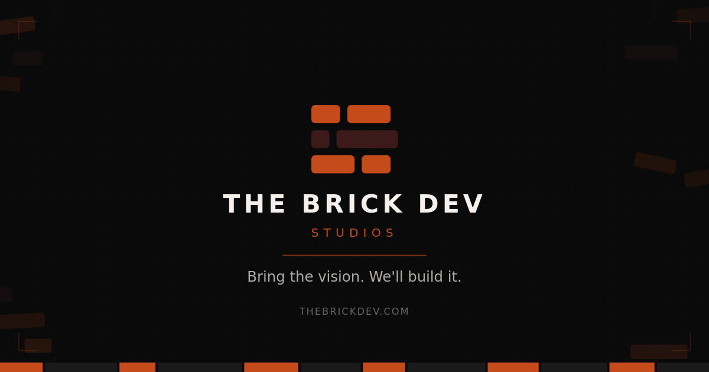

# The Brick Dev Portal

  

  Internal business portal for The Brick Dev Studios

  <a href="https://thebrickdev.com">Website</a> ·
  <a href="mailto:hello@thebrickdev.com">Contact</a>

---

## About

This is the internal admin system we use to run The Brick Dev Studios. It handles client management, invoicing, and payment tracking so we can focus on what we do best: building websites, apps, and platforms that grow businesses.

After 45+ projects and 5+ years of freelancing, we needed something tailored to how we work. So we built it.

## What it does

- **Clients** - Manage prospects and active clients in one place
- **Invoices** - Generate and send invoices in USD, EUR, GBP, or NGN
- **Payments** - Track bank transfers, platform payments (Grey, Payoneer, Wise), and crypto
- **Dashboard** - Revenue overview and monthly income tracking

## Built with

- React
- Supabase
- Vercel

## The Brick Dev Studios

We build websites, web apps, mobile apps, and backend systems for startups and growing businesses. Some of our recent work includes Locappoint, Hairbytimablaq, BlackTribe Fashion, and Opsyn Technologies.

Check out our portfolio at [thebrickdev.com](https://thebrickdev.com)

---

🔒 Private repository

**The Brick Dev Studios**  
[thebrickdev.com](https://thebrickdev.com) · hello@thebrickdev.com